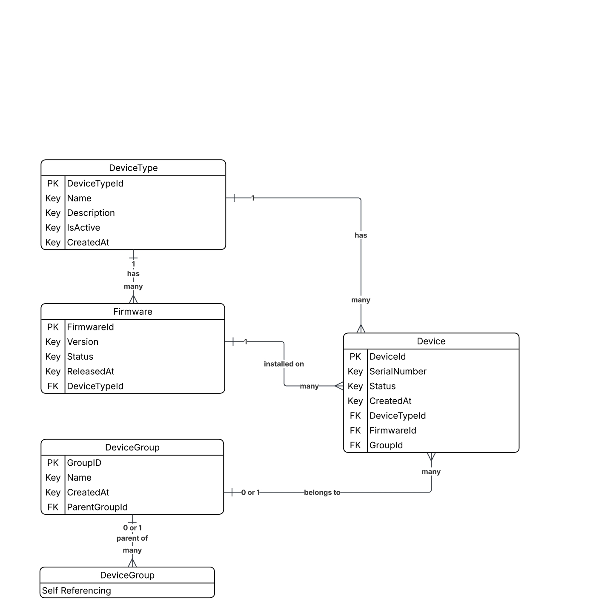

# DATABASE 

## Tables
- There are 4 tables: DeviceType, DeviceGroup, Firmware and Device
- The order they were creates:
   - DeviceType
   - DeviceGroup
   - Firmware
   - Device

## Entity Relationship Diagram

 

## Explanation of Relationships

### DeviceType And Firmware
 - Relationship Type: One-to-Many
 - A **DeviceType** can have multiple **Firmware versions**.  
 - Each **Firmware** belongs to exactly one **DeviceType**.

### Firmware And Device
- Relationship Type: One-to-Many
- A **Firmware version** can be installed on many **Devices**.  
- A **Device** runs one specific **Firmware version** at a time.

### Device Type And Device
- Relationship Type: One-to-Many
- A **DeviceType** can have many **Devices**.  
- Each **Device** belongs to one **DeviceType**.  

### DeviceGroup And Device
- Relationship Type: Optional One-to-Many
- A **DeviceGroup** can contain multiple **Devices**.  
- A **Device** may belong to one **Group**, or none.

### DeviceGroup And DeviceGroup
- Relationship Type: One-to-Many
- A **DeviceGroup** may have one **Parent Group**.  
- A **DeviceGroup** may have many **Child Groups**.  
 
